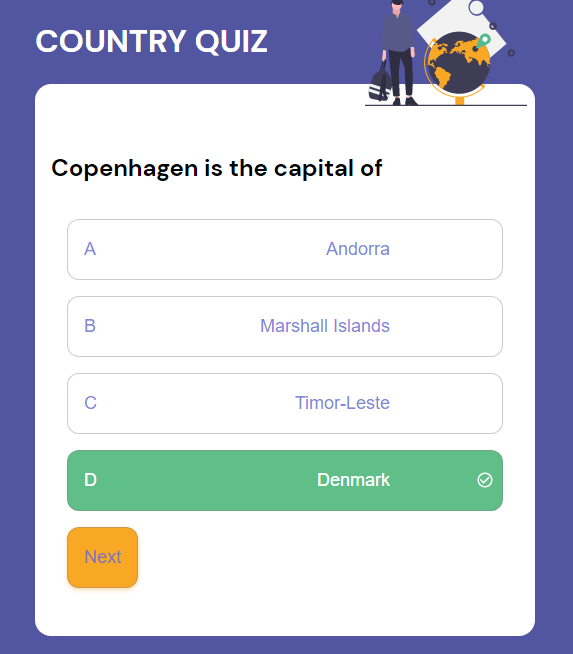
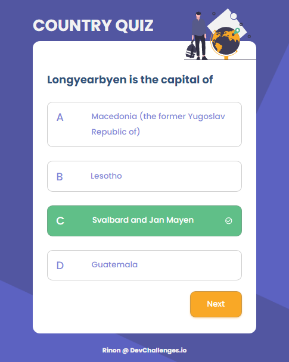
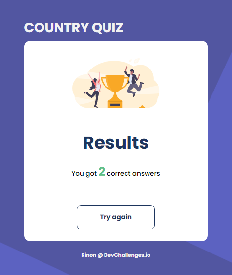

# Country Quiz

Challenge: Creating a country quiz app using an API, and using React to handle the frontend.
<!-- 


-   User story: I can see at least 2 types of question: a city is the capital of.. or a flag belong to country..
-   User story: I can see select an answer
-   User story: I can see if my answer is correct or incorrect
-   User story: When I answer correctly, I can move on to the next question
-   User story: When I answer incorrectly, I can see my results and try again
-   User story: I can try again

**Icon**: https://google.github.io/material-design-icons/

**Live app** : https://country-quiz-app.netlify.app/

As long as you fulfill all the user stories, you can give your personal touches by adding transition, using your own images, changing colors, or even creating your own layout,...

Once you completed, submit your solutions by providing URLs for both GitHub repository and live app on Netlify and explain briefly what you have done.

For the custom domain url you'll enter in netlify, please use the following naming convention : **country-quiz-_YOUR_FIRSTNAME_.netlify.app** (replace YOUR_FIRSTNAME by your firstname)

Good luck everybody!
  -->

<!-- Please update value in the {}  -->
 
<!-- TABLE OF CONTENTS -->

## Table of Contents

- [Overview](#overview)
- [Built With](#built-with)
- [Features](#features)
- [How to use](#how-to-use)
- [Contact](#contact)
 
<!-- OVERVIEW -->

## Finished app screenshot
 





## Demo
My demo can be seen by following this [link](https://countryquiz-play.netlify.app/)
## Design
**Design** : https://www.figma.com/file/Gw0ZNBbYN8asqFlZWy3jG1
## Features
  - Built with React Hooks when applying Context hooks, inline styles and CSS
  - **API**: https://restcountries.eu/. Using data from the API to create questions and answers.
  - Working with one api link but adjusting it to be available for geting the capitals and the countries at the same time. 
  - Toggling between two different questions and displaying four different answers including the write one.
  - Finding the right answer for the country when rendering the data randomly.

1. Wisdom to share:
The best way to improve is to be motivated and always confident to face challenges no matter how difficult it will be.

### Built With
- [React](https://reactjs.org/)
- [CSS](https://developer.mozilla.org/en-US/docs/Web/CSS)

## How To Use

<!-- Example: -->

To clone and run this application, you'll need [Git](https://git-scm.com) and [Node.js](https://nodejs.org/en/download/) (which comes with [npm](http://npmjs.com)) installed on your computer. From your command line:

```bash
# Clone this repository
$ git clone https://github.com/ganamavo/country-quiz

# Install dependencies
$ npm install

# Run the app
$ npm start 
``` 

## Contact

<!-- -   Website [your-website.com](https://{your-web-site-link}) -->
-   GitHub [@ganamavo](https://github.com/ganamavo)
-   Twitter [@rinon](https://twitter.com/RTendrinomena)
